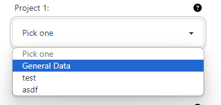
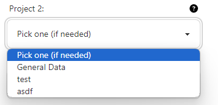
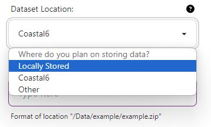
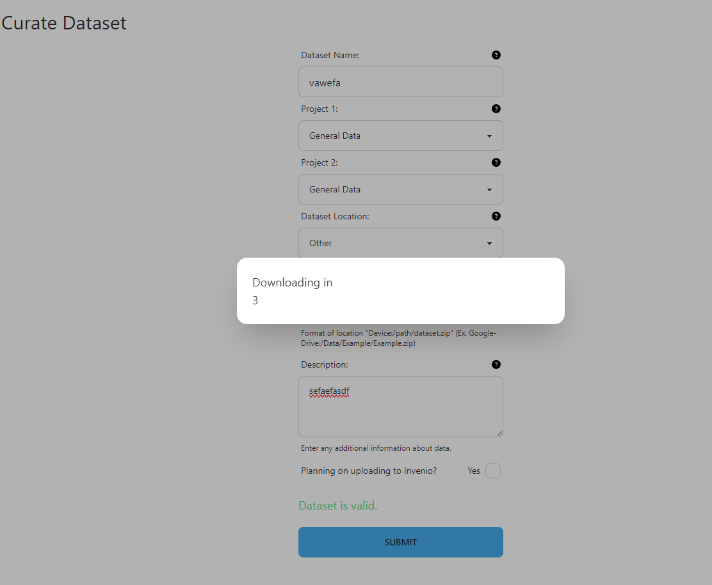
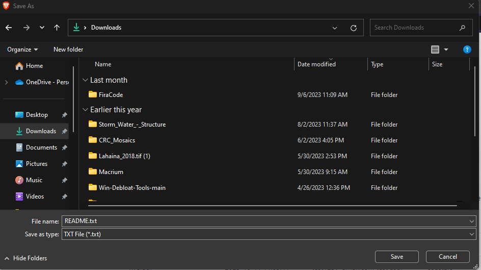

### Field Definitions

 - Dataset Name: Name of the dataset
 - Created: Date and time dataset has been inputted into the UID Tool
 - Creator: Email, First and Last Name of User who curated the data
 - Location Type: The location medium type that the data has been stored
 - Invenio: Is the dataset stored in Invenio?
 - Project 1: The primary projece that the data is associated with (List of projects on project page)
 - Project 2: The secondary project that the data is associated with (List of projects on project page)
 - UID: The unique identity associated with CRC for the data
 - Description: Additional metadata for the dataset name
 - Location: The exact location that the dataset is stored
 - DOWNLOAD DATA README: Button to download a README in txt format that includes all of the information inputted into the UID tool

## <a href="https://coastal5.soest.hawaii.edu/uid-tool/data/create" target="_blank">How to Curate Dataset in UID Tool?</a>

### 1. Type in name that is associated to the dataset

### 2. Select a project from Project 1

- Dataset needs to have at least one associated project. If there's not a specific project associated to the dataset, choose General Data.

### 3. (If needed) Select project from Project 2

- Data may be associated to two project. If not, please leave project 2 as the first option "Pick one (if needed)" this will default to a blank "N/A" project

### 4. Choose where you plan on storing data

Note: This field is only a note for the location of your dataset in a database. It is preferrable to keep dataset on coastal6 and a backup in local storage
- Locally Stored
    - Localle storing dataset includes storing on computer hard drive, external hard drive, or USB drive. Anything that doesn't require network access.
- Coastal6
    - Storing dataset on coastal6 network drive is the prefered storage medium. Storing datasets in CRC network drive, coastal6, requires user to be connected to the SOEST network. 
- Other
    - Other storage methods includes, but not limited to Google Drive, FTP, imina, and mana.

### 5. Type in the location of the dataset

- Depending on the storage medium, type in the **FULL** location of the dataset in a readable format. There are examples of the format depending on the storage medium

### 6. Type description of the dataset

- The description will additional metadata. Please enter include type of file, geolocation that represents the dataset, and the relavent date associated to the dataset if applicable.

### 7. Check/Uncheck checkmark next to "Planning on uploading to Invenio"?…

- If you plan on storing dataset into Invenio RDM eventually, please check the check mark. Otherwise, you can leave it unchecked.

### 8. Click on Submit Button

- When information in the form is ready to be submitted, click the submit button. 

### 9. Download README.txt
- After submitting, a download counter will start...

- Store the README.txt with the dataset for documentation purposes

- The README.txt file will hold the information that you just submitted

 
